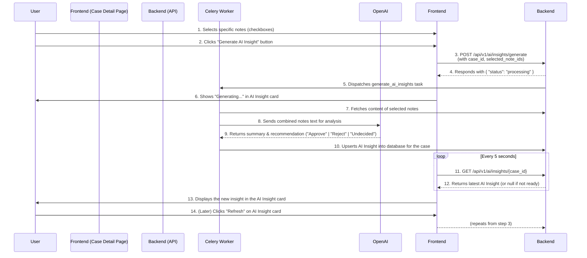

# Development Plan: LawFirm OS MVP

## Phase 1: High-Level Architectural Decisions

### 1.1. Architecture Pattern Selection
*   **Decision**: Modular Monolith
*   **Rationale**: The project is for a solo developer or a small team building an MVP. A Modular Monolith provides the ideal balance of development speed and operational simplicity. It avoids the premature complexity of a microservices architecture while still allowing for a clean, domain-driven separation of concerns within a single codebase. This structure will facilitate rapid, iterative development and can be selectively broken into microservices in the future if specific technical needs, such as extreme scaling for a particular service, arise.

### 1.2. Technology Stack Selection
After extensive research using web_search for the latest stable Long-Term Support (LTS) versions and compatibility verification, the following stack has been selected:
*   **Frontend Framework**: Next.js 14.2.3
    *   **Rationale**: Next.js provides a robust, feature-rich framework for building modern React applications with server-side rendering, static site generation, and a powerful App Router, which is ideal for this project's mix of public-facing and authenticated pages.
*   **UI Components**: shadcn/ui 0.8.0
    *   **Rationale**: shadcn/ui offers unstyled, accessible, and composable components that are co-located with the application code. This provides maximum flexibility and development speed without being locked into a specific design opinion, which is perfect for an MVP.
*   **Backend Runtime**: Python 3.12.4
    *   **Rationale**: Python offers a mature ecosystem, excellent library support (especially for AI and data tasks), and a clean syntax that enhances developer productivity.
*   **Backend Framework**: FastAPI 0.111.0 (with Pydantic 2.x)
    *   **Rationale**: FastAPI is a high-performance Python framework that leverages modern language features for building APIs. Its automatic interactive documentation, dependency injection system, and Pydantic-based data validation are perfectly suited for creating robust, well-defined APIs quickly.
*   **Primary Database**: MongoDB Atlas (Free Tier) with PyMongo 4.7.3
    *   **Rationale**: A document database like MongoDB provides significant schema flexibility, which is a major advantage during agile MVP development where data models (like AI-extracted data or timeline events) are expected to evolve. MongoDB Atlas's free tier is sufficient for development and initial launch, removing local database management overhead.

### 1.3. Core Infrastructure & Services (Local Development Focus)
*   **Local Development**: The frontend and backend will be run directly from the command line without containerization to ensure a fast and simple setup (`npm run dev` and `uvicorn main:app --reload`).
*   **File Storage**: A local, git-ignored `./uploads` directory will be created in the backend project root to store uploaded firm logos.
*   **Job Queues**: Celery with Redis as the message broker will be used for asynchronous background tasks, specifically for processing AI summarization requests without blocking the main application thread.
*   **Authentication**: A library-based approach using JWTs will be implemented. The `python-jose` library will handle token creation and validation, and `passlib[bcrypt]` will be used for secure password hashing.
*   **External Services**:
    *   Payment Processing: Stripe
    *   Calendar Integration: Google Workspace (Calendar & Meet APIs)
    *   AI Service: OpenAI (GPT models)
    *   Transactional Email: Resend

### 1.4. Integration and API Strategy
*   **API Style**: A versioned REST API will be implemented (e.g., `/api/v1/...`).
*   **Standard Formats**:
    *   Success Response: `{"status": "success", "data": { ... }}`
    *   Error Response: `{"status": "error", "message": "A descriptive error message.", "details": { ... }}`

---

## Phase 2: Detailed Module Architecture

The application will be structured into logical modules within the backend monolith and the frontend application.

### 2.1. Backend Module Structure (Modular Monolith)
The backend will be organized into domain-driven modules.
```
app/
├── main.py: Main application entry point.
├── core/: Core settings, configurations, DB connection.
├── database/: Repository pattern implementation for data access.
├── modules/
│   ├── auth/: (AuthModule) Handles user/firm registration, login, JWTs. Owns User model logic.
│   ├── billing/: (BillingModule) Handles Stripe integration, webhooks, subscription logic. Owns Subscription model logic.
│   ├── cases/: (CasesModule) Manages cases, Kanban status, timeline events, notes. Owns Case, TimelineEvent models.
│   ├── firms/: (FirmsModule) Manages firm profiles and settings (case types, intake page). Owns Firm, CaseType, IntakePageSetting models.
│   ├── scheduling/: (SchedulingModule) Manages Google Calendar integration, booking logic. Owns Appointment, ConnectedCalendar models.
│   └── ai_assistant/: (AIModule) Manages async jobs for AI summarization/recommendation. Owns AI_Summary, AI_Recommendation models.
├── shared/: Shared Pydantic models, utilities.
└── workers/: Celery worker definition and tasks.
```

### 2.2. Frontend Module Structure (Next.js)
The frontend will use the Next.js App Router for organization.
```
frontend/
├── app/
│   ├── (public)/: Routes accessible to everyone.
│   │   └── [firmSlug]/page.tsx: The public client intake page.
│   ├── (auth)/: Routes for unauthenticated users.
│   │   ├── login/page.tsx: Login page.
│   │   └── register/page.tsx: Registration page.
│   └── (app)/: Protected routes for authenticated firm users.
│       ├── layout.tsx: Main layout with sidebar/header.
│       ├── dashboard/page.tsx: The CCMS Kanban board.
│       ├── cases/[caseId]/page.tsx: The detailed case profile/timeline view.
│       └── settings/: Layout and pages for all firm settings.
│           ├── profile/page.tsx
│           ├── users/page.tsx
│           ├── integrations/page.tsx
│           └── billing/page.tsx
├── api/: Route handlers for backend-for-frontend patterns if needed.
├── components/: shadcn/ui components and custom shared components.
├── lib/: API client, utility functions, hooks.
└── context/: React Context for managing user session/authentication state.
```

---

## Phase 3: Tactical Sprint-by-Sprint Plan

### Sprint S0: Project Foundation & Setup
*   **Sprint ID & Name**: S0: Project Foundation & Setup
*   **Project Context**: This project, "LawFirm OS," is a SaaS application for law firms to streamline client intake, scheduling, and case triage using AI.
*   **Goal**: To establish a fully configured, runnable project skeleton on the local machine, enabling rapid feature development in subsequent sprints.
*   **Tasks**:
    *   Developer Onboarding: Ask the developer for the URL of their new, empty GitHub repository.
    *   Project Scaffolding: Create a monorepo with `backend` and `frontend` directories. Initialize Git, create a `.gitignore` file, and push the initial structure to the `main` branch. Create a `develop` branch from `main`.
    *   Backend Setup (Python/FastAPI):
        *   Inside the `backend` directory, set up a Python 3.12.4 virtual environment (e.g., `python -m venv venv`).
        *   Create a `requirements.txt` and install `fastapi==0.111.0`, `uvicorn[standard]`, `pydantic==2.x`, `python-dotenv`, `pymongo==4.7.3`.
        *   Create a basic file structure: `app/main.py`, `app/core/config.py`.
    *   Frontend Setup (Next.js & shadcn/ui):
        *   Inside the `frontend` directory, scaffold a new Next.js 14.2.3 application using `npx create-next-app@latest`.
        *   Initialize shadcn/ui using `npx shadcn-ui@latest init`.
    *   Database Setup (MongoDB Atlas):
        *   Instruct the developer to create a new, free-tier M0 cluster on MongoDB Atlas.
        *   Ask the developer to provide their MongoDB Atlas connection string (ensure they add their current IP to the IP Access List).
    *   Configuration:
        *   Create `.env.example` files in both `frontend` and `backend`.
        *   Create `.env` files (added to `.gitignore`) in both directories. The backend `.env` will hold the `DATABASE_URL` provided by the developer. The frontend `.env` will hold `NEXT_PUBLIC_API_BASE_URL=http://127.0.0.1:8000`.
    *   Tooling:
        *   Backend: Configure Black for code formatting.
        *   Frontend: Configure ESLint and Prettier.
    *   "Hello World" Verification:
        *   Backend: Implement the initial MongoDB connection logic in `app/core/db.py` to connect on startup. Create a `/api/v1/health` endpoint in `main.py` that checks the database connection and returns `{"status": "ok"}`.
        *   Frontend: Create a simple client component that fetches data from `/api/v1/health` and displays the status on the homepage.
*   **Verification Criteria**: The developer can clone the repository, run `pip install -r requirements.txt` and `uvicorn app.main:app --reload` in the backend, run `npm install` and `npm run dev` in the frontend, and see a "Status: ok" message on the web page. The backend application successfully connects to the MongoDB Atlas database on startup, confirmed by a console log.

### Sprint S1: Core User & Firm Onboarding
*   **Sprint ID & Name**: S1: Core User & Firm Onboarding
*   **Project Context**: LawFirm OS is a SaaS application for law firms to streamline client intake, scheduling, and case triage using AI.
*   **Previous Sprint's Accomplishments**: S0 established a runnable local development environment. The Next.js frontend and FastAPI backend can communicate, and a connection to MongoDB Atlas is established. The codebase is tracked in a GitHub repository.
*   **Goal**: To implement a complete, secure firm and user registration system, along with login/logout functionality using JWTs.
*   **Relevant Requirements**: FR-001 (Firm Account Registration), FR-017 (Secure User Authentication).
*   **Tasks**:
    *   Database (MongoDB):
        *   In the backend, define Pydantic models for the `users` and `firms` collections. A user will have `email`, `hashed_password`, `name`, `role`, and a `firm_id`. A firm will have `name` and `subscription_status`.
    *   Backend (AuthModule):
        *   Add `passlib[bcrypt]` and `python-jose` to `requirements.txt`.
        *   Implement services for password hashing and verification.
        *   Implement services for creating and decoding JWT access tokens.
        *   Create API endpoints:
            *   `POST /api/v1/auth/register`: Takes `firm_name`, `user_name`, `email`, `password`. Creates a new `Firm` document and a new `User` document (with 'Admin' role).
            *   `POST /api/v1/auth/login`: Takes `email`, `password`. Returns a JWT access token.
        *   Create a dependency in FastAPI to get the current authenticated user from the JWT in the `Authorization` header.
        *   Create a protected endpoint `GET /api/v1/users/me` that uses the dependency to return the current user's data.
    *   Frontend (Next.js):
        *   Create a `RegisterPage` (`/register`) and a `LoginPage` (`/login`) using shadcn/ui components (Card, Input, Button, Label).
        *   Implement client-side form handling and validation for both pages.
        *   Create an API client service (`lib/api.ts`) to make calls to the backend auth endpoints.
        *   Set up a React Context (`context/AuthContext.tsx`) to manage user session state (user data, token, isAuthenticated status). This context will wrap the application layout.
        *   Upon successful login, store the JWT in a secure client-side location (e.g., http-only cookie managed by the server is best, but for this MVP, local storage is acceptable for simplicity, with the understanding it has security trade-offs) and update the `AuthContext`.
        *   Implement a "logout" button that clears the token and auth state.
        *   Create a protected `/dashboard` page that redirects to `/login` if the user is not authenticated. If authenticated, it should display "Welcome, {user.name}".
*   **Version Control**: Commit all changes and push the `develop` branch to GitHub.
*   **Verification Criteria**: A new user can visit the `/register` page, create a firm and an admin account, be redirected to `/login`, log in successfully, be taken to the `/dashboard` page, and see their name. The new firm and user are stored correctly in MongoDB. Logging out and trying to access `/dashboard` redirects back to `/login`.

### Sprint S2: Stripe Subscription & Billing Foundation
*   **Sprint ID & Name**: S2: Stripe Subscription & Billing Foundation
*   **Project Context**: LawFirm OS is a SaaS application for law firms to streamline client intake, scheduling, and case triage using AI.
*   **Previous Sprint's Accomplishments**: S1 implemented user registration and authentication. Firms can create accounts and users can log in to a protected dashboard area.
*   **Goal**: To integrate Stripe for subscription management, allowing a firm to subscribe to a plan and manage their billing via a self-service portal.
*   **Relevant Requirements**: FR-013 (Stripe Payment), FR-014 (Self-Service Portal), FR-015 (Dunning handled by Stripe).
*   **Tasks**:
    *   API Keys & Setup:
        *   Instruct the developer to create a Stripe account and get their API keys (Publishable Key and Secret Key). Also, create a sample subscription product and price in the Stripe dashboard.
        *   Ask the developer for their Stripe Secret Key, Stripe Webhook Signing Secret, and the Price ID of the product. Store these securely in the backend `.env` file.
    *   Backend (BillingModule):
        *   Add `stripe` to `requirements.txt`.
        *   Create an endpoint `POST /api/v1/billing/create-checkout-session`. This endpoint, for an authenticated user, will create a Stripe Checkout session and return the session URL.
        *   Create an endpoint `POST /api/v1/billing/create-customer-portal-session`. This will create and return a URL for the Stripe Customer Portal for the firm's `stripe_customer_id`.
        *   Create a webhook endpoint `POST /api/v1/webhooks/stripe`. This will listen for Stripe events (e.g., `checkout.session.completed`, `customer.subscription.updated`, `customer.subscription.deleted`).
        *   On `checkout.session.completed`, associate the `stripe_customer_id` with the firm and update the firm's `subscription_status` to 'active' in the database.
        *   On other subscription events, update the firm's `subscription_status` accordingly.
    *   Frontend (Next.js):
        *   Create a `/settings/billing` page.
        *   If the firm's subscription status is not 'active', this page should display a "Subscribe Now" button. Clicking it calls the `/create-checkout-session` backend endpoint and redirects the user to the returned Stripe URL.
        *   If the subscription is 'active', the page should display "Status: Active" and a "Manage Billing" button. Clicking it calls `/create-customer-portal-session` and redirects the user to the Stripe Customer Portal.
    *   Middleware/Guards:
        *   Update the backend dependency for protected routes. It should now check not only for a valid JWT but also if the user's firm has an 'active' subscription status for features that require it. For now, this can be applied to a test endpoint.
*   **Version Control**: Commit all changes and push the `develop` branch to GitHub.
*   **Verification Criteria**: A logged-in user can go to the billing page, click "Subscribe", complete the Stripe Checkout flow, and be redirected back to the app. The app should now show their status as "Active". The firm's status in MongoDB must be updated. The user can then click "Manage Billing" to be sent to the Stripe Customer Portal.

### Sprint S3: Google Calendar Integration & Settings
*   **Sprint ID & Name**: S3: Google Calendar Integration & Settings
*   **Project Context**: LawFirm OS is a SaaS application for law firms to streamline client intake, scheduling, and case triage using AI.
*   **Previous Sprint's Accomplishments**: S2 integrated Stripe, allowing firms to subscribe and manage their billing. The application can now differentiate between free/unsubscribed and paid/active users.
*   **Goal**: To allow a firm to securely connect their Google account via OAuth2, enabling the application to access their calendar for scheduling.
*   **Relevant Requirements**: Integration part of FR-012 and backend setup for FR-005.
*   **Tasks**:
    *   API Keys & Setup:
        *   Instruct the developer to set up a project in the Google Cloud Platform Console, enable the Google Calendar API, and create OAuth 2.0 credentials (Web application type).
        *   Ask the developer for their Google Client ID and Client Secret. Store these in the backend `.env` file.
        *   Configure the "Authorized redirect URIs" in the Google Console to point to a new backend callback endpoint (e.g., `http://127.0.0.1:8000/api/v1/integrations/google/callback`).
    *   Backend (SchedulingModule):
        *   Add `google-api-python-client` and `google-auth-oauthlib` to `requirements.txt`.
        *   Create a new `connected_calendars` collection in MongoDB to store `firm_id`, `access_token`, `refresh_token`, and the chosen `calendar_id`.
        *   Create an endpoint `GET /api/v1/integrations/google/authorize`. This generates the Google OAuth consent screen URL (with calendar scope and `access_type=offline`) and returns it to the frontend.
        *   Create the callback endpoint `GET /api/v1/integrations/google/callback`. This handles the code exchange from Google, fetches the access and refresh tokens, stores them securely in the database against the firm, and marks the integration as complete.
        *   Create an endpoint `GET /api/v1/integrations/google/calendars`. If the firm is authenticated with Google, this uses the stored tokens to call the Google Calendar API, fetch a list of the user's calendars, and return it.
        *   Create an endpoint `POST /api/v1/integrations/google/calendars/select`. This allows the user to designate one calendar ID from the list as the one to be used for booking. Store this ID in the database.
    *   Frontend (Next.js):
        *   Create a `/settings/integrations` page.
        *   This page will display the status of the Google Calendar integration. Initially, it will show "Not Connected" and a "Connect Google Account" button.
        *   Clicking the button calls the `/authorize` endpoint and redirects the user to the Google consent screen.
        *   After the user authorizes and is redirected back to the app, the frontend should show a "Connected" status. It should then call the `/calendars` endpoint and display a dropdown list of the user's calendars.
        *   The user can select a calendar and click "Save" to call the `/select` endpoint.
*   **Version Control**: Commit all changes and push the `develop` branch to GitHub.
*   **Verification Criteria**: A user can navigate to `/settings/integrations`, click to connect their Google account, go through the full OAuth2 flow, and return to the app. The page should then display their available calendars. They can select one and save it. The tokens and selected calendar ID must be stored in the MongoDB database.

### Sprint S4: Public Intake Form & Calendar Booking UI
*   **Sprint ID & Name**: S4: Public Intake Form & Calendar Booking UI
*   **Project Context**: LawFirm OS is a SaaS application for law firms to streamline client intake, scheduling, and case triage using AI.
*   **Previous Sprint's Accomplishments**: S3 implemented the Google Calendar OAuth2 integration. The application can now securely access a firm's designated calendar on their behalf.
*   **Goal**: To build the complete, client-facing intake and scheduling workflow. A prospective client can fill out a form and book a meeting on the firm's calendar.
*   **Relevant Requirements**: FR-003 (Customizable Page), FR-004 (Intake Form), FR-005 (Calendar Booking).
*   **Tasks**:
    *   Database (MongoDB):
        *   Define Pydantic models for `cases`, `appointments`, `case_types`, and `intake_page_settings`.
    *   Backend (FirmsModule, CasesModule, SchedulingModule):
        *   In `FirmsModule`, create CRUD endpoints for managing Case Types (`/api/v1/settings/case-types`).
        *   In `FirmsModule`, create endpoints to get/update Intake Page Settings (`/api/v1/settings/intake-page`).
        *   In `CasesModule`, create a public endpoint `POST /api/v1/intake/{firmId}`. This receives the intake form data, creates a new `Case` with status 'New Lead', and associates it with the firm.
        *   In `SchedulingModule`, create a public endpoint `GET /api/v1/intake/{firmId}/availability`. This fetches the firm's connected calendar ID, calls the Google Calendar API to get free/busy information for the next 14 days, and returns available time slots.
        *   In `SchedulingModule`, create a public endpoint `POST /api/v1/intake/{caseId}/book`. This receives a selected time slot, creates an event in the firm's Google Calendar (with a Google Meet link), creates an `Appointment` document linked to the `Case`, and updates the `Case` status to 'Meeting Scheduled'.
    *   Frontend (Next.js):
        *   Create a `/settings/case-types` page where firm users can add/edit/delete case types.
        *   Create a `/settings/intake-page` where users can set a welcome message and upload a logo (using local file storage on the backend).
        *   Create the dynamic public route `/[firmSlug]/page.tsx`. This page will fetch the firm's settings and display the customized welcome message, logo, and the intake form.
        *   The intake form will have fields for name, email, phone, issue description, and a dropdown for Case Type populated from the firm's settings.
        *   Upon successful form submission, the app will transition to a booking view on the same page. This view will fetch and display available time slots.
        *   When a client selects a slot and confirms, the app will call the booking endpoint and show a confirmation message.
*   **Version Control**: Commit all changes and push the `develop` branch to GitHub.
*   **Verification Criteria**: A firm can configure their case types and intake page. A prospective client can visit the public URL, see the customizations, fill out the form, submit it, select a time slot, and book a meeting. A new case should appear in the `cases` collection in MongoDB, and a corresponding event with a Google Meet link should appear in the firm's Google Calendar.

### Sprint S5: Case Management Kanban Board (CCMS)
*   **Sprint ID & Name**: S5: Case Management Kanban Board (CCMS)
*   **Project Context**: LawFirm OS is a SaaS application for law firms to streamline client intake, scheduling, and case triage using AI.
*   **Previous Sprint's Accomplishments**: S4 delivered the end-to-end client intake and scheduling flow. New cases are now being created in the database and meetings are being booked.
*   **Goal**: To build the central Kanban dashboard where firm users can visually track and manage the pipeline of new cases.
*   **Relevant Requirements**: FR-006 (CCMS with Kanban Dashboard).
*   **Tasks**:
    *   Backend (CasesModule):
        *   Create an endpoint `GET /api/v1/cases` that returns all cases for the authenticated user's firm.
        *   Create an endpoint `PATCH /api/v1/cases/{caseId}/status` that allows updating the status of a case (e.g., from 'Meeting Scheduled' to 'Pending Review').
    *   Frontend (Next.js):
        *   Install a drag-and-drop library (e.g., `dnd-kit`).
        *   On the `/dashboard` page, build the Kanban UI. It should have columns for the stages: 'New Lead', 'Meeting Scheduled', 'Pending Review', 'Engaged', 'Rejected'.
        *   Fetch all cases from the backend and render them as cards in the appropriate columns based on their status.
        *   Case cards should display client name, case type, and the upcoming meeting date/time if available.
        *   Implement drag-and-drop functionality. When a card is moved to a new column, call the backend endpoint to update the case's status. The UI should update optimistically.
        *   Make each card a link to the (yet to be created) case detail page, e.g., `/cases/{caseId}`.
*   **Version Control**: Commit all changes and push the `develop` branch to GitHub.
*   **Verification Criteria**: A logged-in firm user can go to the dashboard and see all cases created from the intake form, displayed as cards in the correct columns. They can drag a case from "Meeting Scheduled" to "Pending Review," and the change is persisted in the database and reflected on the UI.

### Sprint S6: Case Profile Timeline & Manual Notes
*   **Sprint ID & Name**: S6: Case Profile Timeline & Manual Notes
*   **Project Context**: LawFirm OS is a SaaS application for law firms to streamline client intake, scheduling, and case triage using AI.
*   **Previous Sprint's Accomplishments**: S5 created the core CCMS Kanban dashboard, allowing firms to manage their case pipeline visually.
*   **Goal**: To build the detailed case view, showing a complete chronological history and allowing users to add internal notes, including pasting meeting notes.
*   **Relevant Requirements**: FR-007 (Automated Case Profile Timeline).
*   **Tasks**:
    *   Backend (CasesModule):
        *   Create a `timeline_events` collection model. Events will have `case_id`, `timestamp`, `type` ('SYSTEM' or 'NOTE'), `content`, and `user_id` (for notes).
        *   Modify the case creation and booking logic from Sprint 4 to automatically create `TimelineEvent` documents (e.g., "Intake form submitted by {Client Name}", "Consultation scheduled for {Date}").
        *   Create an endpoint `GET /api/v1/cases/{caseId}` that returns all details for a single case, including a sorted list of its associated timeline events.
        *   Create an endpoint `POST /api/v1/cases/{caseId}/notes` that allows an authenticated user to add a new text note to the case, which creates a 'NOTE' type `TimelineEvent`.
    *   Frontend (Next.js):
        *   Create the dynamic page `/cases/[caseId]/page.tsx`.
        *   This page will fetch the detailed case data from the backend.
        *   Display the core case details at the top (Client Info, Case Type, Status).
        *   Render the timeline events in a chronological list. System events and user notes should be styled differently for clarity.
        *   Include a prominent `Textarea` component for "Meeting Notes". Add a "Save Notes" button next to it.
        *   Clicking "Save Notes" will post the content to the `/notes` endpoint, and the new note should appear on the timeline upon success.
*   **Version Control**: Commit all changes and push the `develop` branch to GitHub.
*   **Verification Criteria**: When a user clicks a Kanban card, they are navigated to the case detail page. This page displays the client's submitted information and a timeline of events (form submission, meeting booked). The user can type notes into a text area, save them, and see them appear on the timeline.

### Sprint S7 (Final Plan): User-Driven AI Insights

*   **Sprint ID & Name**: S7: User-Driven AI Insights
*   **Project Context**: LawFirm OS is a SaaS application for law firms to streamline client intake, scheduling, and case triage using AI.
*   **Previous Sprint's Accomplishments**: S6 delivered the detailed case profile page, where users can view a case's history and add manual notes from their consultations.
*   **Goal**: To empower users to generate actionable AI-powered summaries and recommendations on demand by selecting specific case notes, and to display these insights in a dedicated, clear, and up-to-date section on the case profile page.
*   **Relevant Requirements**: FR-008 (AI Summarization), FR-009 (AI Recommendation).

#### High-Level Workflow Diagram



#### Detailed Tasks

**1. Backend (AIModule, CasesModule & Worker)**

*   **Database Model (`ai_insights` collection):**
    *   Create a new Pydantic model and MongoDB collection for `AIInsight`.
    *   Fields: `case_id` (indexed), `summary` (string), `recommendation` (string), `justification` (string), `created_at` (datetime), `source_note_ids` (list of strings).
*   **API Endpoint (Generation):**
    *   Create a new endpoint: `POST /api/v1/ai/insights/generate`.
    *   The request body will contain `case_id` and a list of `note_ids`.
    *   This endpoint will trigger the Celery task asynchronously.
*   **API Endpoint (Retrieval):**
    *   Create a new endpoint: `GET /api/v1/ai/insights/{case_id}`.
    *   This will fetch and return the single, most recent `AIInsight` document for the given `case_id`.
*   **Celery Task (`generate_ai_insights`):**
    *   Modify the task to accept `case_id` and a list of `note_ids`.
    *   The task will fetch the text content for each `note_id`.
    *   It will construct a detailed prompt for the OpenAI API, instructing it to return a JSON object with a `summary`, a `recommendation`, and a `justification`. The `recommendation` field **must** be one of three specific values: `"Approve"`, `"Reject"`, or `"Undecided"`.
    *   After receiving the response, it will perform an **upsert** on the `ai_insights` collection using the `case_id`, replacing any existing insight.

**2. Frontend (Case Detail Page)**

*   **Timeline Notes UI:**
    *   Add a `Checkbox` component to each user-generated note on the timeline.
*   **"Generate AI Insight" Button:**
    *   Add a "Generate AI Insight" button, disabled unless at least one note is selected.
    *   On click, it calls the generation endpoint.
*   **AI Insight Card Component (`AIInsightCard.tsx`):**
    *   Create a new `Card` component to display the AI Insight.
    *   **States:**
        *   **Empty:** "No AI Insight has been generated."
        *   **Loading:** "Generating insight..."
        *   **Display:** Shows the `summary` and `justification`. The `recommendation` ("Approve", "Reject", "Undecided") should be displayed prominently, with distinct visual cues (e.g., colors or icons).
    *   **Refresh Button:** Include a "Refresh" icon button on the card to re-trigger the generation.
*   **Polling Mechanism:**
    *   After triggering generation, the frontend will poll the retrieval endpoint every 5 seconds until a result is returned, then update the card.

**3. Verification Criteria**

*   A user can select notes and click "Generate AI Insight".
*   The frontend shows a loading state, then automatically updates with the AI summary and recommendation.
*   The recommendation correctly displays as "Approve", "Reject", or "Undecided".
*   Generating a new insight replaces the old one in the database and on the UI.

### Sprint S8: Final Touches (User Management & Notifications)
*   **Sprint ID & Name**: S8: Final Touches (User Management & Notifications)
*   **Project Context**: LawFirm OS is a SaaS application for law firms to streamline client intake, scheduling, and case triage using AI.
*   **Previous Sprint's Accomplishments**: S7 successfully integrated the core AI features, completing the primary value proposition of the MVP.
*   **Goal**: To add user management for firm admins and implement critical email notifications to complete the communication loop.
*   **Relevant Requirements**: FR-012 (Users/Roles), FR-018 (Email Notifications).
*   **Tasks**:
    *   API Keys & Setup:
        *   Instruct the developer to create a Resend account and generate an API key.
        *   Ask the developer for their Resend API Key and store it in the backend `.env` file.
    *   Backend (AuthModule & Email Service):
        *   Add `resend` to `requirements.txt`.
        *   Create a simple email service that can send emails using the Resend API.
        *   Update the booking logic (`POST /api/v1/intake/{caseId}/book`) to send two emails:
            *   A confirmation email to the client with meeting details.
            *   A notification email to the firm about the new booking.
        *   In the `AuthModule`, create endpoints for user management, accessible only to 'Admin' users:
            *   `POST /api/v1/settings/users/invite`: (For MVP, this can just create a new user with a temporary password and status 'pending' - full invite flow is complex).
            *   `GET /api/v1/settings/users`: Lists all users in the firm.
            *   `PATCH /api/v1/settings/users/{userId}`: Updates a user's role or status (e.g., deactivate).
            *   `DELETE /api/v1/settings/users/{userId}`: Deletes a user.
    *   Frontend (Next.js):
        *   Create the `/settings/users` page, accessible only to admins.
        *   The page will display a list of all users in the firm with their roles.
        *   Include a form/modal to "Invite" a new user by email and assign a role ('Admin', 'Lawyer').
        *   Provide options on each user in the list to change their role or deactivate/delete them.
    *   Role-Based Access Control (RBAC):
        *   Refine the backend route protection. Ensure that settings-related endpoints (Billing, Users, Integrations) are only accessible to users with the 'Admin' role. Case management endpoints should be accessible to both 'Admin' and 'Lawyer' roles.
        *   Update the frontend to hide navigation links (e.g., Settings) for users without the 'Admin' role.
*   **Version Control**: Commit all changes and push the `develop` branch to GitHub.
*   **Verification Criteria**: An admin user can navigate to `/settings/users`, see themselves in the list, and add a new user with the 'Lawyer' role. That new user can log in but cannot see the Settings link in the navigation. When a client books a meeting, both the client and the firm receive a confirmation email.